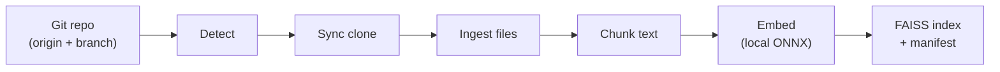

# RAGCode

Transform Git repositories into searchable context for AI agents and MCP clients.

ragcode indexes a repository's source files into a local vector store keyed by remote, branch, and embedding model. Agents can retrieve relevant code and documentation chunks by semantic similarity instead of loading entire trees into context.

## How it works



1. **Detect** — Reads `origin` and the current branch from the Git repository you run the command in.
2. **Sync** — Clones or refreshes a mirror under `~/.ragcode/repos/...`.
3. **Ingest** — Walks the tree, loading text, HTML, and PDF files while skipping binaries, `node_modules`, `.git`, and other noise.
4. **Chunk** — Splits documents with a recursive character splitter (LangChain-compatible defaults).
5. **Embed** — Generates normalized sentence embeddings locally via [hugot](https://github.com/knights-analytics/hugot) and ONNX (no API keys required).
6. **Index** — Writes a FAISS-compatible bundle plus a manifest recording commit SHA, model, and chunk settings.

The resulting index is designed to be consumed by query tools and MCP servers that perform similarity search over repository context.

## Requirements

- Go 1.26+
- `git` on your `PATH`
- Network access on first run (to clone the remote and download the embedding model)

## Installation

```bash
git clone git@github.com:i3onilha/ragcode.git
cd ragcode
go build -o ragcode ./cmd/ragcode/
```

Or install directly:

```bash
go install github.com/i3onilha/ragcode/cmd/ragcode@latest
```

## Quick start

From inside a cloned Git repository with `origin` configured and a checked-out branch:

```bash
ragcode ingest
```

Example output:

```
INFO git: github.com/acme/my-project branch main
INFO git: syncing remote https://github.com/acme/my-project.git
INFO git: repository ready at /home/you/.ragcode/repos/github.com/acme/my-project/main
INFO pipeline: starting ingestion for ... @ a1b2c3d
INFO ingestion: loaded internal/rag/config/config.go (1 segment(s))
...
INFO chunking: split 142 document(s) into 891 chunk(s)
INFO embeddings: downloading/loading model KnightsAnalytics/all-MiniLM-L6-v2
INFO pipeline: embedding 891 chunk(s)
INFO vectorstore: saved 891 vectors (dim=384) to /home/you/.ragcode/indexes/...
Indexed repository. Clone: /home/you/.ragcode/repos/github.com/acme/my-project/main
FAISS saved to: /home/you/.ragcode/indexes/github.com/acme/my-project/main/all-MiniLM-L6-v2
```

Re-running `ingest` fetches the latest `origin/<branch>`, re-indexes the clone, and overwrites the index for that branch and model.

### Ask questions

After indexing, ask grounded questions about the repository using an LLM via [OpenRouter](https://openrouter.ai/):

```bash
export OPENROUTER_API_KEY=sk-or-...
ragcode ask "How does authentication work?"
```

Or run interactively:

```bash
ragcode ask
```

The command loads the index for the current repository (same remote/branch as `ingest`), retrieves the top-*k* relevant chunks, and generates an answer strictly from that context.

## Storage layout

All caches live under `~/.ragcode` by default (override with `GIT_FAISS_HOME`):

```
~/.ragcode/
├── cache/models/          # Downloaded ONNX embedding models
├── repos/
│   └── <host>/<owner>/<repo>/<branch>/
│       └── ...            # Bare working clone synced to origin
└── indexes/
    └── <host>/<owner>/<repo>/<branch>/<embedding-model>/
        ├── vectors.bin    # float32 vectors (little-endian)
        ├── docstore.json  # Chunk text, metadata, and ID mapping
        └── manifest.json  # Provenance: commit SHA, model, chunk settings
```

Branch and model names with `/` are sanitized to `--` in directory names (e.g. `feature/login` → `feature--login`).

### Index manifest

Each index directory includes a `manifest.json` with fields such as:

| Field | Description |
|-------|-------------|
| `remote_url` | Git remote used for the clone |
| `commit_sha` | Indexed commit |
| `embedding_model` | Model name used for vectors |
| `chunk_size` / `chunk_overlap` | Splitter settings |
| `vector_count` | Number of indexed chunks |
| `ingested_at` | UTC timestamp of the build |

## Configuration

Optional environment variables (also loadable from `.env`):

| Variable | Default | Description |
|----------|---------|-------------|
| `GIT_FAISS_HOME` | `~/.ragcode` | Root directory for clones, indexes, and model cache |
| `EMBEDDING_MODEL` | `all-MiniLM-L6-v2` | Sentence-transformers model name (mapped to an ONNX build for hugot) |
| `EMBED_BATCH_SIZE` | `4` | Texts per ONNX inference batch |
| `EMBED_WORKERS` | `min(CPU count, 4)` | Concurrent embedding workers (hugot pipeline is thread-safe) |
| `CHUNK_SIZE` | `1000` | Target chunk size in characters |
| `CHUNK_OVERLAP` | `200` | Overlap between consecutive chunks |
| `TOP_K` | `5` | Number of chunks retrieved for `ragcode ask` |
| `OPENROUTER_API_KEY` | — | API key for LLM answers (required for `ask`) |
| `OPENROUTER_MODEL` | `google/gemma-3-12b-it:free` | Default chat model |
| `OPENROUTER_RAG_MODEL` | — | Overrides `OPENROUTER_MODEL` for `ask` |
| `OPENROUTER_BASE_URL` | `https://openrouter.ai/api/v1` | OpenRouter API base URL |

## What gets indexed

**Included:** UTF-8 text files, HTML (text extracted), PDF (per-page text).

**Skipped directories:** `.git`, `node_modules`, `vendor`, `__pycache__`, `.venv`, `dist`, `build`, `bin`, and similar.

**Skipped file types:** Binaries, images, archives, fonts, media, compiled artifacts, model weights (`.onnx`, `.pt`, etc.), and files over 10 MiB.

Each chunk retains a `source` metadata field with the file path, plus a `chunk_index` for ordering.

## Project structure

```
cmd/ragcode/              # CLI entrypoint (ingest + ask)
internal/rag/
├── chunking/            # Recursive text splitter
├── config/              # Environment-based settings
├── document/            # Document type
├── embeddings/          # Local ONNX embeddings (hugot)
├── generator/           # OpenRouter LLM answer generation
├── gitrepo/             # Remote detection, clone/sync, paths
├── ingestion/           # File loading and filtering
├── pipeline/            # Ask orchestration (retrieve + generate)
├── retriever/           # Semantic chunk retrieval
└── vectorstore/         # FAISS-compatible index read/write
```

## Development

```bash
go test ./...
go build -o ragcode ./cmd/ragcode/
```

## Use with AI agents and MCP

ragcode provides both **indexing** (`ingest`) and **querying** (`ask`). The vector bundles it produces are intended for:

- **Semantic code search** — Find functions, types, and docs related to a natural-language question.
- **RAG context injection** — Supply top-*k* chunks to an LLM instead of whole files.
- **MCP tools** — Expose `search_repo`, `get_chunk`, or similar tools backed by the on-disk index.

Point your query layer or MCP server at the index path under `~/.ragcode/indexes/<host>/<owner>/<repo>/<branch>/<model>/`. The `docstore.json` and `vectors.bin` files use an L2 metric layout compatible with FAISS-based retrieval.

## License

See repository license file for terms.
